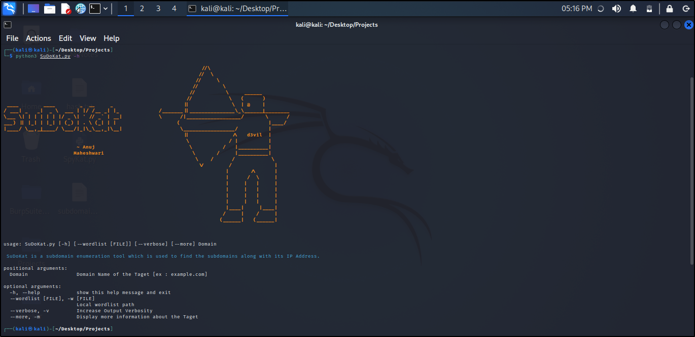

<h1 align="center"> SuDoKat </h1>

<div align="center">
  
  
  
  
  

</div>



SuDoKat is a subdomain enumeration tool which is used to find the subdomains along with its IP Address. It's build with:
- Python
- DnsPython
- UrlLib

## Features
- [x] Fast
- [x] Powerful
- [x] Convenient use
- [x] Easy
- [x] Detect 100%

## Usage

```
usage: main.py [-h] [--wordlist [FILE]] [--verbose] [--more] Domain
SuBrute is A Simple Subdomain Enumeration Tool 
positional arguments:
  Domain                Domain Name of the Taget [ex : example.com]
optional arguments:
  -h, --help            show this help message and exit
  --wordlist [FILE], -w [FILE]
                        Local wordlist path
  --verbose, -v         Increase Output Verbosity
  --more, -m            Display more information about the Taget
  
```

## Working


